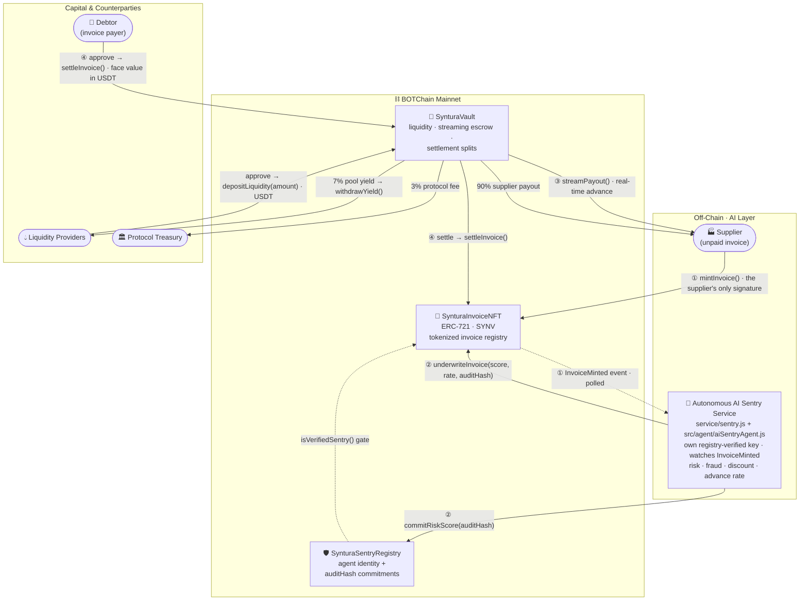
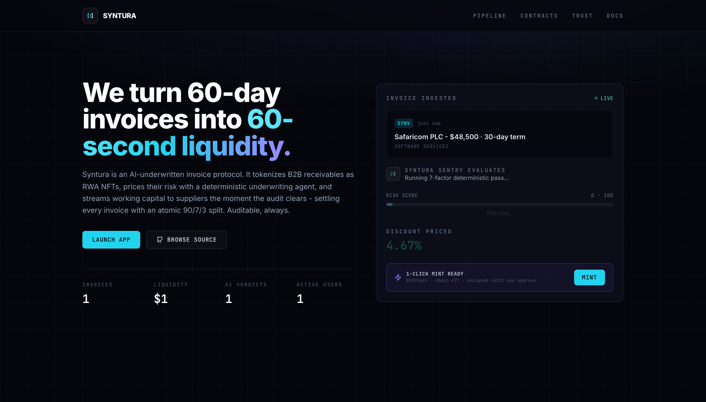
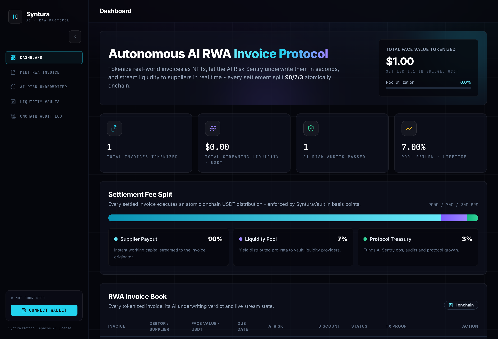
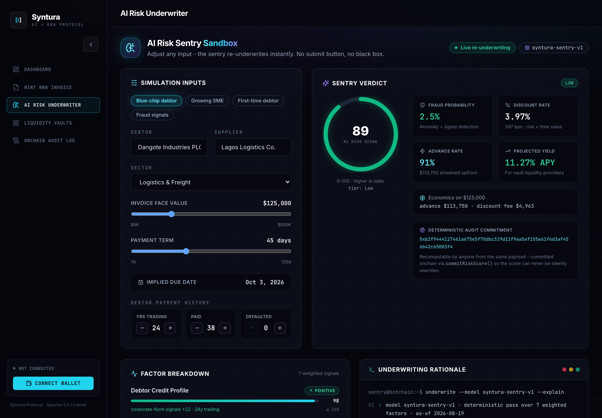
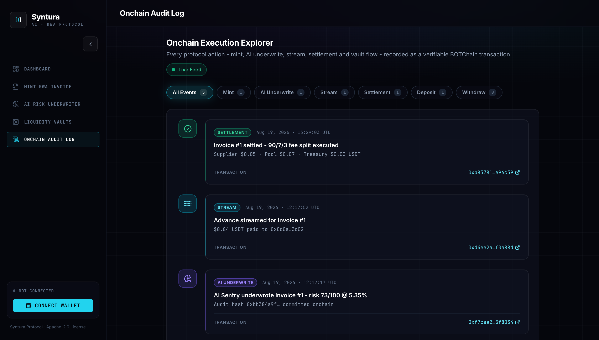

<div align="center">

# Syntura

### Autonomous AI RWA Invoice & Real-Time Yield Streaming Protocol

**Tokenize real-world invoices as NFTs · Underwrite them with a deterministic, auditable AI risk agent · Stream working capital to suppliers in real time · Settle with an automated 90 / 7 / 3 split - all on BOTChain Mainnet.**

[](#botchain-network-configuration)
[](#smart-contracts)
[](#frontend-feature-tour)
[](./LICENSE)
[](#why-syntura-wins-season-2)

*Built by **Ifeanyichukwu Onwo** (`mrnetwork`) for the BOTChain Builder Challenge #2 - Season 2: AI × RWA.*

</div>

---

## Table of Contents

1. [Executive Summary](#executive-summary)
2. [Why Syntura Wins Season 2](#why-syntura-wins-season-2)
3. [Architecture](#architecture)
4. [Repository Structure](#repository-structure)
5. [Smart Contracts](#smart-contracts)
6. [The AI Risk Sentry](#the-ai-risk-sentry)
7. [Autonomous AI Sentry Service](#autonomous-ai-sentry-service)
8. [Frontend Feature Tour](#frontend-feature-tour)
9. [Quickstart](#quickstart)
10. [Settlement Fee Split](#settlement-fee-split)
11. [Security Model](#security-model)
12. [BOTChain Network Configuration](#botchain-network-configuration)
13. [Roadmap](#roadmap)
14. [License](#license)

---

## Executive Summary

**$3+ trillion of the world's SME invoices sit unpaid at any moment.** Suppliers who have already delivered goods wait 30–90 days for payment, while banks decline the majority of small-business factoring requests - slowest and most opaque in exactly the emerging markets that need working capital most.

**Syntura** turns an unpaid invoice into a productive on-chain asset in four autonomous stages:

| Stage | What Happens | Where |
|-------|-------------|-------|
| **1 · Tokenize** | A supplier mints their invoice as an ERC-721 RWA NFT (`SYNV`) with face value, debtor, and due date on-chain | `SynturaInvoiceNFT.sol` |
| **2 · AI Underwrite** | The **AI Risk Sentry** - a deterministic, explainable scoring agent running as an autonomous service under its own registry-verified key, not the supplier's wallet - computes a 0–100 risk score, fraud probability, discount rate, and advance rate, then **commits a deterministic 256-bit audit hash of its full reasoning onchain** (FNV-1a/xorshift construction; keccak256 planned) | `service/sentry.js` + `src/agent/aiSentryAgent.js` + `SynturaSentryRegistry.sol` |
| **3 · Stream** | The liquidity vault streams the advance (typically ~85% of face value) to the supplier in real time - no 60-day wait | `SynturaVault.sol` |
| **4 · Settle** | When the debtor pays, settlement executes an atomic **90% supplier / 7% liquidity pool / 3% treasury** split, and LPs withdraw yield pro-rata | `SynturaVault.sol` |

The result: suppliers get same-day liquidity, liquidity providers earn yield from real settlement cash flows, and every AI decision that moved money is **verifiable on the BOTChain explorer** - not a black box.

---

## Why Syntura Wins Season 2

Season 2's brief is **AI × RWA**. Syntura is not "AI-adjacent" or "RWA-adjacent" - the AI agent and the real-world asset are structurally fused at the contract level.

### Track 1 alignment - Autonomous AI agents on-chain

- **A real agent, not a chatbot wrapper.** `src/agent/aiSentryAgent.js` is a pure-ESM, zero-dependency underwriting model that runs identically in the browser and in Node (`npm run sentry:demo`). It scores debtor credit, term risk, sector risk, size bands, due-date proximity, and fraud signals.
- **Actually autonomous, not a button.** `service/sentry.js` is a standalone Node watcher that holds its own registered key, polls BOTChain for `InvoiceMinted`, reruns the identical model, and submits `underwriteInvoice` + `commitRiskScore` with no human in the loop. The supplier signs one transaction; the agent signs its own. See [Autonomous AI Sentry Service](#autonomous-ai-sentry-service).
- **On-chain agent identity.** `SynturaSentryRegistry.sol` registers sentries by address + model ID (`syntura-sentry-v1`). Only **verified** sentries can underwrite invoices - the NFT contract gates `underwriteInvoice` through the registry.
- **Accountable AI.** Every underwriting decision produces a deterministic `auditHash` (a 32-byte commitment over the payload + scores) that is committed on-chain via `commitRiskScore`. Anyone can re-run the open-source model on the same inputs and verify the hash. Determinism is a hard design rule: identical payloads always produce identical results (hash-derived jitter, no `Math.random`).

### Track 2 alignment - Real-world assets with real cash flows

- **A genuinely productive RWA.** Invoices are self-liquidating assets with a defined maturity - the canonical entry point for on-chain RWA credit.
- **Full lifecycle on-chain.** Mint → underwrite → stream → settle, each emitting indexed events (`InvoiceMinted`, `InvoiceUnderwritten`, `PayoutStreamed`, `InvoiceSettled`) that the in-app **On-Chain Audit Log** renders as an explorer-linked timeline.
- **Real yield mechanics.** LP returns come from settlement fees on real invoice cash flows (the 7% pool cut), not token emissions.

### Execution quality

- Three production-grade Solidity 0.8.24 contracts (OpenZeppelin v5, ReentrancyGuard, pull-payments, NatSpec throughout).
- A polished five-screen React 18 + Vite dApp, fully chain-backed: every invoice, vault balance and audit entry is read from the deployed contracts, and every action is a wallet-signed BOTChain transaction routed through the ethers v6 layer in `src/lib/chain.js`.
- One-command deploy pipeline to BOTChain (`npm run deploy:botchain`) that wires all three contracts together and prints ready-to-paste `VITE_*` env lines.

---

## Architecture



**The four-stage pipeline, end to end:**

1. **Tokenize** - the supplier mints the invoice as an ERC-721 (`mintInvoice`), putting face value, debtor, and due date on-chain. That single transaction is the supplier's entire involvement.
2. **AI Underwrite** - the autonomous sentry service picks the new invoice up from the `InvoiceMinted` event, scores it, and writes `riskScore`, `discountRateBps`, and the reasoning `auditHash` to both the NFT and the registry, signed by its own registry-verified key.
3. **Streaming Liquidity** - LP capital in the vault streams the advance to the supplier the moment underwriting clears (`streamPayout`).
4. **90/7/3 Settlement** - debtor repayment triggers the atomic split; the NFT is marked settled and pool yield becomes claimable via pull-payment `withdrawYield`.

---

## Repository Structure

```
Syntura/
├── contracts/
│   ├── SynturaInvoiceNFT.sol        # ERC-721 RWA invoice registry (SYNV)
│   ├── SynturaVault.sol             # Liquidity + streaming escrow + 90/7/3 settlement
│   └── SynturaSentryRegistry.sol    # AI agent identity + risk-score commitments
├── scripts/
│   ├── deploy_syntura.js            # Full BOTChain deploy + wiring + env output
│   └── sentry_demo.js               # Run the AI Sentry standalone in Node
├── service/                         # Autonomous sentry service - its own npm package
│   ├── sentry.js                    # Watcher: scans InvoiceMinted, scores, writes verdicts
│   ├── package.json                 # ESM · ethers v6 + dotenv only
│   ├── .env.example                 # RPC · sentry key placeholder · addresses · tuning
│   ├── syntura-sentry.service       # Hardened systemd unit template
│   └── README.md                    # VPS deployment runbook + key rotation
├── src/
│   ├── agent/
│   │   └── aiSentryAgent.js         # Deterministic AI underwriting model (browser + Node)
│   ├── components/
│   │   ├── layout/
│   │   │   ├── Sidebar.jsx          # Nav, branding, network status
│   │   │   └── Topbar.jsx           # Page title, mode chip, wallet connect
│   │   └── ui/
│   │       └── Glass.jsx            # Design kit: GlassCard, StatCard, Badge, RiskGauge…
│   ├── context/
│   │   └── SynturaStore.jsx         # Chain-backed protocol state + signed actions
│   ├── lib/
│   │   ├── chain.js                 # BOTChain config, ABIs, providers, wallet, explorer links
│   │   ├── mockData.js              # Seed invoice book, vault metrics, audit trail
│   │   └── utils.js                 # Formatters (USD, %, dates, hashes)
│   ├── pages/
│   │   ├── Dashboard.jsx            # Protocol overview + invoice lifecycle table
│   │   ├── MintInvoice.jsx          # Tokenization flow with live AI underwriting
│   │   ├── RiskUnderwriter.jsx      # Interactive AI Sentry sandbox + sentry network
│   │   ├── LiquidityVaults.jsx      # Deposit, positions, yield, pool utilization
│   │   └── AuditLog.jsx             # On-chain execution explorer timeline
│   ├── App.jsx                      # Shell: sidebar + topbar + animated page routing
│   ├── index.css                    # Tailwind layers + glassmorphism component classes
│   └── main.jsx                     # Entry: <SynturaProvider><App/></SynturaProvider>
├── hardhat.config.cjs               # Solidity 0.8.24 + botchain network from .env
├── .env.example                     # RPC / chain ID / keys / contract address template
├── index.html · vite.config.js · tailwind.config.js · postcss.config.js
├── package.json                     # ESM · scripts: dev, build, compile, deploy:botchain, sentry:demo
└── LICENSE                          # Apache-2.0
```

---

## Smart Contracts

All contracts are **Solidity `^0.8.24`**, built on **OpenZeppelin v5**, fully NatSpec-documented, SPDX `Apache-2.0`. The frontend consumes them through human-readable ethers v6 ABIs in [`src/lib/chain.js`](./src/lib/chain.js) - a hard interface contract between the dApp and the chain.

### `SynturaInvoiceNFT.sol` - ERC-721 "Syntura RWA Invoice" (`SYNV`)

Each token wraps an `Invoice` struct: `{ invoiceId, supplier, debtorName, faceValueUSD, dueDate, riskScore, discountRateBps, isUnderwritten, isSettled }`. `faceValueUSD` is an 18-decimal USD wad (`$1 = 1e18`); so are the amounts in this contract's events. USDT base units live one layer down, in the vault.

| Function | Access | Purpose |
|----------|--------|---------|
| `mintInvoice(string debtorName, uint256 faceValueUSD, uint256 dueDate, string metadataURI) → uint256` | Any supplier | Tokenizes an invoice; mints the NFT to `msg.sender` |
| `underwriteInvoice(uint256 invoiceId, uint16 riskScore, uint16 discountRateBps, bytes32 auditHash)` | Verified sentry (via registry) or owner | Attaches the AI risk assessment + audit commitment to the invoice |
| `settleInvoice(uint256 invoiceId)` | Vault or owner | Marks the invoice settled at maturity |
| `getInvoice(uint256) → Invoice` | View | Full invoice struct read |
| `totalInvoices() → uint256` | View | Count of tokenized invoices |

**Events:** `InvoiceMinted(invoiceId, supplier, faceValueUSD, dueDate)` · `InvoiceUnderwritten(invoiceId, riskScore, discountRateBps, auditHash)` · `InvoiceSettled(invoiceId, supplierPayout, poolFee, treasuryFee)`

### `SynturaVault.sol` - Liquidity, Streaming Escrow & Settlement

Holds LP capital, streams advances against underwritten invoices, and executes the **90 / 7 / 3** settlement split (constants `9000 / 700 / 300` BPS). The vault is **denominated in bridged USDT** (6 decimals): it holds no native balance, and every amount below is USDT base units.

| Function | Access | Purpose |
|----------|--------|---------|
| `depositLiquidity(uint256 amount)` | Anyone | Provide streaming liquidity to the pool - pulls `amount` USDT via `transferFrom`, so **the caller must `approve` the vault first** |
| `streamPayout(uint256 invoiceId)` | Guarded (underwritten invoices only) | Streams the advance to the invoice's supplier; per-invoice streamed amounts tracked |
| `withdrawYield()` | LP (pull payment) | Claims the caller's pro-rata share of accumulated pool fees |
| `totalLiquidity() → uint256` | View | Total pooled capital |
| `yieldOf(address) → uint256` | View | Claimable yield for a provider |
| `faceValueUnits(uint256 invoiceId) → uint256` | View | The authoritative settlement amount: face value converted once to USDT base units |
| `settleInvoice(uint256 invoiceId)` | Debtor repayment path | Pulls exactly `faceValueUnits(invoiceId)` in USDT (**an ERC-20 approval is required first**), pays the 90/7/3 split and calls `invoiceNFT.settleInvoice` atomically |

**Events:** `LiquidityDeposited(provider, amount)` · `PayoutStreamed(invoiceId, supplier, amount)` · `YieldWithdrawn(provider, amount)` · `SettlementExecuted(invoiceId, supplierPayout, poolFee, treasuryFee)` - all amounts in USDT base units

### `SynturaSentryRegistry.sol` - AI Agent Identity & Commitments

The accountability layer: which model said what, about which asset, provably.

| Function | Access | Purpose |
|----------|--------|---------|
| `registerSentry(address agent, string modelId)` | Owner | Registers a verified AI sentry (e.g. `syntura-sentry-v1`) |
| `commitRiskScore(uint256 invoiceId, uint16 riskScore, bytes32 auditHash)` | Verified sentry | Stores the immutable commitment to the sentry's full reasoning |
| `isVerifiedSentry(address) → bool` | View | Gate used by the NFT contract to authorize underwriting |

**Events:** `SentryRegistered(agent, modelId)` · `RiskScoreCommitted(invoiceId, agent, riskScore, auditHash)`

---

## The AI Risk Sentry

`src/agent/aiSentryAgent.js` is the protocol's underwriter: a **pure-ESM, zero-dependency, explainable multi-factor scoring model** that runs in the browser (instant sandbox re-scoring) and in Node (`npm run sentry:demo`) with identical output.

### Inputs → Outputs

```
underwriteInvoice({ debtorName, supplierName, faceValueUSD, termDays,
                    dueDate, sector, debtorYearsTrading?,
                    priorInvoicesPaid?, priorInvoicesDefaulted? })
  → { riskScore (0–100, higher = safer), fraudProbability (%),
      discountRateBps, tier "Low"|"Medium"|"High", advanceRatePct,
      expectedYieldAPY, factors[], rationale[], auditHash }
```

### The factor model

Each signal lands in the `factors` array with an explicit weight (0–1), a 0–100 sub-score, an impact direction, and a plain-English note - nothing is hidden:

| Factor | What it measures |
|--------|-----------------|
| **Debtor credit profile** | Name-keyword heuristics + trading history (`debtorYearsTrading`) proxying counterparty strength |
| **Payment history** | `priorInvoicesPaid` vs `priorInvoicesDefaulted` - the strongest empirical repayment signal |
| **Invoice size band** | Very small and very large tickets carry asymmetric risk; mid-band invoices score best |
| **Payment-term risk curve** | Longer `termDays` = more exposure time; risk rises non-linearly with tenor |
| **Sector risk table** | Per-sector base rates across the 10 supported sectors (logistics, software, agri/FMCG, healthcare, …) |
| **Due-date proximity** | Sanity checks maturity against term; near/past-due invoices are penalized |
| **Fraud signal scan** | Round-number amounts, term/due-date mismatches, size implausible vs history → feeds `fraudProbability` |

The **discount rate** is then derived from composite risk plus the time value of the term, the **advance rate** (~85% typical) scales with the risk tier, and `classifyRisk()` maps the score to a `Low / Medium / High` tier used consistently across the UI.

### Determinism + on-chain accountability

- **Deterministic by construction:** identical payloads always produce byte-identical results. Any "jitter" is derived from hashing the payload itself - there is no `Math.random` anywhere in the model.
- **`auditHash`** is a 64-hex-char commitment computed over the payload and every score the model produced. It is committed on-chain via `SynturaSentryRegistry.commitRiskScore` and stored on the invoice NFT.
- **Verify it yourself:** the model is open source - re-run `underwriteInvoice` on the same inputs and recompute the hash. If it matches the on-chain commitment, the AI's decision is proven untampered. This is AI you can audit, not AI you must trust.

---

## Autonomous AI Sentry Service

The model above is the brain. `service/` is the agent that acts on it: a standalone Node package that holds its own registry-verified key, watches BOTChain for newly minted invoices, reruns the identical model, and writes the verdict onchain by itself.

### Why it exists: supplier and sentry are different actors

`underwriteInvoice` and `commitRiskScore` are gated on `isVerifiedSentry(msg.sender)`. A supplier's wallet is not a verified sentry and never should be - an asset owner who can score their own asset is not underwriting, it is self-attestation. So the roles are split:

| Actor | Holds | Signs |
|-------|-------|-------|
| **Supplier** (browser wallet) | nothing privileged | exactly one transaction: `mintInvoice()` |
| **Sentry service** (own host) | a dedicated key registered as `syntura-sentry-v1` | `underwriteInvoice()` then `commitRiskScore()`, autonomously |
| **Registry** (onchain) | the verified-sentry set | nothing - it is the gate both writes pass through |

**The browser never holds the sentry key.** It exists only in `service/.env` on the machine running the service - gitignored, never bundled into the frontend, never sent to a visitor. The frontend now mints with a **single transaction** and then simply polls `getInvoice(id)` until the sentry's verdict lands, showing an honest "the autonomous sentry is underwriting onchain" state while it waits.

Because both sides run the same open-source model, the mint screen compares the verdict it reads back from the chain against the one it computed locally before minting. Matching risk score, discount rate and audit hash is determinism demonstrated by two independent processes, not asserted in a doc.

### What the watcher does

- **Startup:** resolves the wallet, logs only its address, chain ID and BOT balance, checks `isVerifiedSentry(self)`, and warns loudly with the exact `registerSentry(...)` call to run if it is not registered - without exiting, since it may be registered while running.
- **Each tick:** reads `totalInvoices()`, then scans `InvoiceMinted` logs from the last processed block in bounded chunks. On a cold start, or when the state file is missing, it sweeps every id instead - so **invoices minted while the service was down are still picked up**.
- **Payload reconstruction:** debtor, face value (an 18-decimal USD wad), and due date come from the invoice struct; sector, supplier name, term days and optional debtor history come from `tokenURI(id)`. Malformed or absent metadata falls back to sane defaults, and term days are derived from the mint block timestamp when missing.
- **Race guard:** `getInvoice(id)` is re-read immediately before sending, and the two writes go out **sequentially** (nonce order matters), awaiting confirmations between them.
- **Logging:** one structured line per invoice - id, debtor, face value, risk, tier, discount, and both tx hashes.
- **State:** `{ lastProcessedBlock, pending, done }` written atomically each tick, so a restart resumes exactly where it stopped.

**Nothing gets stranded.** Every invoice is handled in its own try/catch: a failure lands the id in `pending` for bounded retry on later ticks and never stops the loop. Provider errors back off exponentially and reset on success, an "already underwritten" revert counts as success, and `SIGINT`/`SIGTERM` finishes the in-flight invoice, persists state, and exits 0.

### Running the service

```bash
cd service
npm ci
cp .env.example .env        # fill in SENTRY_PRIVATE_KEY - the service's own key, not the deployer's

node sentry.js --once       # one pass over every outstanding invoice, then exit 0
npm start                   # or watch continuously
```

`--once` makes the same binary usable as a cron job, a post-deploy smoke test, or a manual catch-up run.

| Variable | Purpose |
|----------|---------|
| `BOTCHAIN_RPC_URL` | Read/write RPC endpoint (`https://rpc.botchain.ai`) |
| `SENTRY_PRIVATE_KEY` | The service's own registered sentry key - provisioned separately, never committed |
| `INVOICE_NFT_ADDRESS` / `SENTRY_REGISTRY_ADDRESS` | The two contracts it reads from and writes to |
| `START_BLOCK` | First block for the log scan (deploy block `19906390`) |
| `POLL_MS` / `MAX_BLOCK_SPAN` / `CONFIRMATIONS` | Tick interval, log-scan chunk size, confirmations per tx |
| `STATE_FILE` | Path to the atomically written JSON cursor |

### Production

`service/syntura-sentry.service` is a hardened systemd unit template (`Restart=always`, `NoNewPrivileges`, `PrivateTmp`, `ProtectSystem=strict` with a narrow `ReadWritePaths` for the state file) that reads the same `.env` and logs to the journal:

```bash
sudo systemctl enable --now syntura-sentry
journalctl -fu syntura-sentry
```

The full VPS runbook - clone, install, smoke test, systemd install, key rotation, and how the registry owner registers a sentry address - lives in [`service/README.md`](./service/README.md).

### Run your own sentry

Nothing about the service is privileged: it is plain ESM against two public contracts, using the exact model in this repo. Generate a key, have the registry owner register the address with your own model ID, point the `.env` at the same contracts, and your agent underwrites alongside the reference one. Several sentries can watch the same chain safely - the invoice's `isUnderwritten` flag makes the write single-shot, so the first verdict to land wins and the others skip it.

---

## Frontend Feature Tour

Dark terminal-style dApp - React 18, Vite 5, Tailwind, framer-motion, lucide icons. Fully responsive, animated page transitions, every transaction deep-linked to the BOTChain explorer. Screenshots below are the live app at [syntura.xyz](https://syntura.xyz) reading BOT Chain Mainnet - the figures are real settled invoices, not mockups.



**Dashboard** - live protocol stats, the 90/7/3 settlement split, and the invoice book with per-row lifecycle actions.



**AI Risk Underwriter** - an interactive sandbox where every input re-prices the invoice instantly, with the full factor breakdown and the deterministic audit commitment.



**Onchain Audit Log** - every mint, underwrite, stream, deposit and settlement as an explorer-linked timeline built from contract events.



| # | Screen | What it shows |
|---|--------|---------------|
| 1 | **Dashboard** | Hero + live protocol stats (invoices tokenized, streaming liquidity, AI audits passed, average APY), the 90/7/3 fee-split visual, and the full invoice book with per-row lifecycle actions - **Start Stream** on underwritten invoices, **Settle** on streaming ones, with live progress bars and tx links |
| 2 | **Mint RWA Invoice** | The tokenization flow: validated invoice form → animated "AI Sentry analyzing…" phase → complete underwriting report (risk gauge, fraud probability, discount, advance rate, factor breakdown, terminal-style rationale, audit hash) → optional client-side document anchoring → **a single mint transaction**, then a live "the autonomous sentry is underwriting onchain" wait that resolves into the onchain verdict, with a chip confirming it matches the locally predicted score byte for byte |
| 3 | **AI Risk Underwriter** | The Sentry showcase: an interactive sandbox where sliders and inputs **re-underwrite instantly** as you move them - watch the risk gauge, discount rate, and factor weights respond in real time. Below, the Sentry Network panel reads the live `SynturaSentryRegistry` - registered model ID, agent address, and on-chain commitment count |
| 4 | **Liquidity Vaults** | Vault stats, USDT deposit with quick-pick chips ($1/$5/$25), your wallet's USDT balance and the two-step approve-then-deposit progress, projected-yield math, your position + pull-payment yield withdrawal, pool utilization, and a 3-step "how streaming yield works" explainer |
| 5 | **On-Chain Audit Log** | An execution explorer: a filterable, color-coded timeline of every protocol event (MINT / AI_UNDERWRITE / STREAM / SETTLEMENT / DEPOSIT / WITHDRAW), newest first, each entry linking to the BOTChain explorer |

**Nothing is mocked:** the store reads invoices from `getInvoice`, vault accounting from the vault's view functions, and the audit timeline from indexed contract events; mint/stream/settle/deposit/withdraw are wallet-signed transactions, and underwriting is signed by the [autonomous sentry service](#autonomous-ai-sentry-service) rather than by the user. Pending invoices show as queued for the sentry; if the connected wallet *is* a registry-verified sentry, the dashboard and mint screen also expose a manual underwrite action as an operator fallback. Before contract addresses land in `.env`, the app shows an explicitly empty **Awaiting deployment** state instead of fake data.

**Units and settlement:** invoices are USD-denominated - the NFT stores face value as an 18-decimal USD wad (`$1 = 1e18`), a unit of account rather than a token balance. Settlement moves the real [bridged USDT on BOTChain](https://scan.botchain.ai/address/0xababc7ddc03e501d190c676bf3d92ef0e6e87a3c) (`0xababc7ddc03e501d190c676bf3d92ef0e6e87a3c`, 6 decimals) 1:1 against that face value, so a **$5 invoice settles as exactly 5.000000 USDT** and every dollar shown in the app is a literal dollar of stablecoin - the old `1 USD = 10¹² wei` demo peg is gone. The vault converts wad to token units internally by dividing by `USD_WAD_PER_TOKEN_UNIT` (`1e12`), and `faceValueUnits(id)` is the authoritative settlement amount that the dApp and the sentry service read instead of repeating the conversion. Native **BOT is still the gas asset**, so a wallet needs both, and because USDT is an ERC-20, deposits and settlements are two-step flows: `approve(vault, amount)` for the exact amount needed, then the vault call.

---

## Quickstart

**Prerequisites:** Node 18+, npm.

```bash
# 1 · Install
npm install

# 2 · Configure environment
cp .env.example .env        # then fill in the values (see footnote below)

# 3 · Run the dApp (shows an empty Awaiting-deployment state until step 4)
npm run dev                 # → http://localhost:5173

# 4 · Compile the contracts
npm run compile

# 5 · Deploy the full protocol to BOTChain
npm run deploy:botchain     # deploys Registry → InvoiceNFT → Vault, wires them,
                            # registers the deployer as sentry, prints VITE_* lines for .env

# 6 · Run the AI Sentry standalone (Node, no browser)
npm run sentry:demo

# 7 · Start the autonomous sentry service (separate package, own key)
cd service && npm ci && cp .env.example .env && npm start
```

Paste the `VITE_INVOICE_NFT_ADDRESS` / `VITE_VAULT_ADDRESS` / `VITE_SENTRY_REGISTRY_ADDRESS` lines printed by the deploy script into `.env`, restart `npm run dev`, and the topbar flips from **Awaiting deployment** to **Live · BOTChain** - from that point every button is a mainnet transaction.

Mint from **any** wallet: minting is one transaction and requires no special rights. Underwriting is not part of that flow - it is done by the sentry service from step 7, running under its own registry-verified key, so keep that process alive (or run `node sentry.js --once`) or freshly minted invoices simply stay queued until it next runs. See [Autonomous AI Sentry Service](#autonomous-ai-sentry-service).

---

## Settlement Fee Split

Every settled invoice executes one atomic split, enforced by BPS constants in `SynturaVault.sol`:

| Recipient | Share | BPS | Rationale |
|-----------|-------|-----|-----------|
|  **Supplier** | **90%** | `9000` | The business that did the work keeps the overwhelming majority |
|  **Liquidity Pool** | **7%** | `700` | Real-world yield for LPs - claimable pro-rata via `withdrawYield()` |
|  **Protocol Treasury** | **3%** | `300` | Sustains the protocol; address set at deploy (`TREASURY_ADDRESS`) |

Example - a $48,500 invoice settles as: supplier **$43,650** · pool **$3,395** · treasury **$1,455**, exactly as emitted in `SettlementExecuted` and rendered in the in-app audit log.

---

## Security Model

- **ReentrancyGuard** on every value-moving function in `SynturaVault` (`depositLiquidity`, `streamPayout`, `withdrawYield`, settlement).
- **Pull-over-push payments** - LP yield accrues in-contract and is withdrawn by the provider (`withdrawYield`), never force-sent, eliminating gas-griefing and reentrancy vectors on distribution.
- **Sentry gating** - `underwriteInvoice` is callable only by an address the registry marks `isVerifiedSentry` (or the owner as a break-glass path). Unregistered agents cannot influence risk pricing.
- **Role separation** - the wallet that mints an invoice is never the wallet that scores it. Underwriting runs in the [autonomous sentry service](#autonomous-ai-sentry-service) under a dedicated key that exists only in `service/.env` on the service host: it is gitignored, never bundled into the frontend, and never reaches a browser. Suppliers cannot underwrite their own paper, and the dApp never asks a user for a permission they should not have.
- **Role-scoped settlement** - only the vault can mark an invoice settled (there is deliberately no owner escape hatch); suppliers cannot self-settle.
- **Asset authenticity** - at mint, the underlying invoice document can be fingerprinted client-side (SHA-256, the file never leaves the browser) with the hash anchored on-chain in the token metadata; anyone holding the original can verify it against the token, and the in-app docs include a live verifier. Roadmap hardening: debtor counter-signatures (EIP-712), independent third-party sentries, an optional KYB compliance tier, and legal receivable-assignment references.
- **Auditability by default** - every state transition emits an indexed event, and every AI decision carries an on-chain hash commitment that anyone can recompute from the open-source model.
- **No secrets in code** - keys, RPC endpoints, and the treasury address live exclusively in `.env` files (see `.env.example` and `service/.env.example`); `PRIVATE_KEY` is only ever read by Hardhat at deploy time, and `SENTRY_PRIVATE_KEY` only by the sentry process. Both `.env` files and the service's `state.json` are gitignored, and no key is ever logged - the service prints its address and balance, never its key.

>  Hackathon-stage software: the contracts follow established OpenZeppelin patterns but have **not** undergone an external audit. Do not deploy with meaningful value before one.

---

## BOTChain Network Configuration

### Deployed contracts - live on BOT Chain Mainnet, source-verified

All three contracts are **source-verified on the explorer** - each address below shows readable Solidity, the ABI, and a Read/Write console.

| Contract | Address |
|----------|---------|
| `SynturaInvoiceNFT` (SYNV) | [`0xD8816ecf2D243f4B5328502ACAB83a9dF043A40a`](https://scan.botchain.ai/address/0xD8816ecf2D243f4B5328502ACAB83a9dF043A40a) |
| `SynturaVault` (USDT-settled) | [`0x5eD988A1367495aB895714F062A66E509e5E0D3d`](https://scan.botchain.ai/address/0x5eD988A1367495aB895714F062A66E509e5E0D3d) |
| `SynturaSentryRegistry` | [`0x19B0c0BB8A654b950739B84776A5951BA4ABf676`](https://scan.botchain.ai/address/0x19B0c0BB8A654b950739B84776A5951BA4ABf676) |
| Autonomous AI sentry (`syntura-sentry-v1`) | [`0x51d6E0829111b477E237528f7f90740055fDfF8e`](https://scan.botchain.ai/address/0x51d6E0829111b477E237528f7f90740055fDfF8e) |
| Settlement token (bridged USDT, 6 dp) | [`0xaBabc7Ddc03e501d190C676BF3d92ef0e6e87a3C`](https://scan.botchain.ai/address/0xaBabc7Ddc03e501d190C676BF3d92ef0e6e87a3C) |
| Owner / treasury | [`0x6d8C0D2dBAa4c55e264Ccb7AcdCf9f727B9a0635`](https://scan.botchain.ai/address/0x6d8C0D2dBAa4c55e264Ccb7AcdCf9f727B9a0635) |

The vault is wired into the NFT (`setVault`) and the sentry is registry-verified, so `underwriteInvoice` is gated through `isVerifiedSentry`. The [autonomous sentry service](#autonomous-ai-sentry-service) holds that dedicated key on its own server - the deployer key is never online to underwrite, and the browser never holds a sentry key at all.

> An earlier vault at `0x7199D8db46142B784ab4De225EADf91f4F10ca14` settled in native BOT. It was replaced by the USDT vault above and is no longer wired to the NFT; it is listed only so the migration is traceable.

### Proven onchain

The full lifecycle has executed on mainnet, not just in tests:

| | |
|---|---|
| `#SYNV-001` | Minted, underwritten by the autonomous sentry, advance streamed, then **settled** - the 90/7/3 split paid $0.0535 supplier residual, $0.07 pool, $0.03 treasury |
| `#SYNV-002` | Minted by an **external wallet** (`0x9E05d95c...79ed`), underwritten by the sentry **7 seconds later** with no human involvement |

All chain parameters are **environment-driven**, with the verified BOT Chain Mainnet values as fallback defaults:

| Parameter | Value |
|-----------|-------|
| Network | **BOT Chain Mainnet** |
| Chain ID | **677** (`0x2a5`) |
| RPC | `https://rpc.botchain.ai` |
| Explorer | [`https://scan.botchain.ai`](https://scan.botchain.ai) |
| Gas currency | BOT (18 decimals) |
| Settlement token | Bridged USDT (6 decimals) - [`0xababc7ddc03e501d190c676bf3d92ef0e6e87a3c`](https://scan.botchain.ai/address/0xababc7ddc03e501d190c676bf3d92ef0e6e87a3c) |

| Variable | Used by | Purpose |
|----------|---------|---------|
| `BOTCHAIN_RPC_URL` / `BOTCHAIN_CHAIN_ID` | Hardhat (`hardhat.config.cjs`) | Deploy target |
| `VITE_BOTCHAIN_RPC_URL` / `VITE_BOTCHAIN_CHAIN_ID` / `VITE_BOTCHAIN_EXPLORER_URL` | Frontend (`src/lib/chain.js`) | Providers, wallet add/switch-chain, explorer deep-links |
| `VITE_INVOICE_NFT_ADDRESS` / `VITE_VAULT_ADDRESS` / `VITE_SENTRY_REGISTRY_ADDRESS` | Frontend | Enables live mode when set |
| `VITE_USDT_ADDRESS` | Frontend | Settlement token; defaults to the bridged USDT above and is also required for live mode |

> **Note on network values:** chain ID 677 and the RPC/explorer endpoints above match the public BOT Chain Mainnet registry ([chainlist.org/chain/677](https://chainlist.org/chain/677)) and were verified live via `eth_chainId` against `https://rpc.botchain.ai`. If the BOTChain team publishes different official endpoints for the challenge, point `.env` at those - no code changes required. Until contract addresses are configured, the dApp transparently labels itself **"Awaiting deployment"** in the topbar and shows an empty state rather than fake data.

---

## Roadmap

- **Multi-stablecoin settlement** - the vault settles in bridged USDT today; per-invoice choice of settlement token (and a bridge/swap path into it) is next.
- **Continuous per-block streaming** - upgrade `streamPayout` from advance-tranche streaming to true per-second vesting curves.
- **Multi-sentry consensus** - N-of-M verified sentries must agree (registry already supports multiple agents) before large invoices clear underwriting.
- **ZK-verified underwriting** - replace the hash commitment with a zero-knowledge proof that the published model produced the score, without revealing debtor data.
- **Secondary market** - order book for trading underwritten `SYNV` invoice NFTs before maturity.
- **Real-world ingestion** - e-invoicing API integrations (PEPPOL, local African e-invoice mandates) so invoices tokenize directly from accounting systems.
- **Debtor identity attestations** - on-chain credit registries and DID attestations feeding the Sentry's debtor-profile factor.
- **Treasury governance** - hand the 3% treasury stream to a token-governed DAO.

---

## License

**Apache License 2.0** - see [LICENSE](./LICENSE).

<div align="center">

*Syntura - turning the world's unpaid invoices into transparent, AI-underwritten, yield-streaming assets on BOTChain.*

** Built for BOTChain Builder Challenge #2 · Season 2: AI × RWA · by Ifeanyichukwu Onwo (mrnetwork)**

</div>
